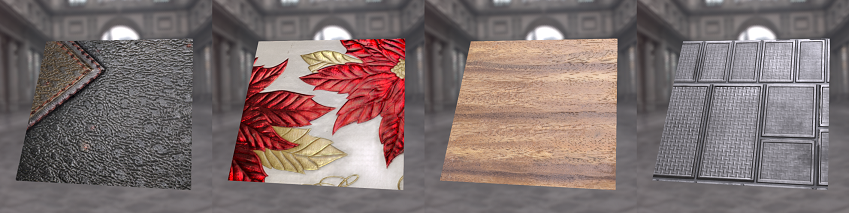

# DeepInverseRendering

Source code of our paper: 

Deep Inverse Rendering for High-resolution SVBRDF Estimation from an Arbitrary Number of Images

> Duan Gao, Xiao Li, Yue Dong, Pieter Peers, Kun Xu, Xin Tong.
>
> ACM Transactions on Graphics (Proceedings of SIGGRAPH 2019)*




**More information (including our paper, supplementary, video and slides) can be found at [My Personal Page](https://gao-duan.github.io/).**

If you have any questions about our paper, please feel free to contact me (gao-d17@mails.tsinghua.edu.cn)


## Pretrained models

Our pretrained SVBRDF auto-encoder can be downloaded from [here](https://drive.google.com/open?id=17WrAZIkyejwRm5aKBtTvNHYe_3c6S9aE).


## Dependencies 

- Python (with opencv-python, numpy; test on Python 3.6)

- Tensorflow-gpu (test on tensorflow>1.10)

  

## Usage

- Eval mode (captured images as input)

```bash
   python3 main.py 
      --N $input_numbers            # number of input images
      --checkpoint $checkpoint      # pretrained model of auto-encoder
      --dataDir $images_data_dir    # folder contains a set of input images
      --logDir $log_dir             # output folder
      --initDir  $init_dir          # folder contains initial SVBRDF maps or initial code 
      --network $network            # network architecture (default: network_ae_fixBN)
    
      --init_method svbrdf          
      --input_type image 
      --wlv_type $wlv_dir 
```

- Test mode (SVBRDF map as input)
```bash
python3 main.py 
   --N $input_numbers 
   --checkpoint $checkpoint 
   --dataDir $svbrdf_data_dir 
   --logDir $log_dir 
   --initDir  $init_dir 
   --network $network  
   
   --init_method svbrdf 
   --input_type svbrdf 
   --wlv_type random 
```

- Other command arguments:

```
-- input_type: ['image', 'svbrdf']
   
   'image':  a set of images, used in evaluate.
   
   'svbrdf':  a set of SVBRDFs, used in testing.
   
   
-- init_method: ['svbrdf', 'code', 'rand']

 'svbrdf': the estimated SVBRDF (using our encoder to embedding it into our latent     space)
 
 'code':  the latent code (numpy array)
 
 'rand': random initialization the latent code


-- wlv_type: ['random', 'load']
   
   'random': random generate camera position and light position
   
   'load': load camera position and light position from file
```

- Example data can be found in `example_data` folder.

## Citation

If you use our code or pretrained models, please cite as following:

```
@article{gao2019deep,
  title={Deep inverse rendering for high-resolution SVBRDF estimation from an arbitrary number of images},
  author={GAO, DUAN and Li, Xiao and Dong, Yue and Peers, Pieter and Xu, Kun and Tong, Xin},
  journal={ACM Transactions on Graphics (TOG)},
  volume={38},
  number={4},
  pages={134},
  year={2019},
  month={July},
  publisher={ACM}
}
```